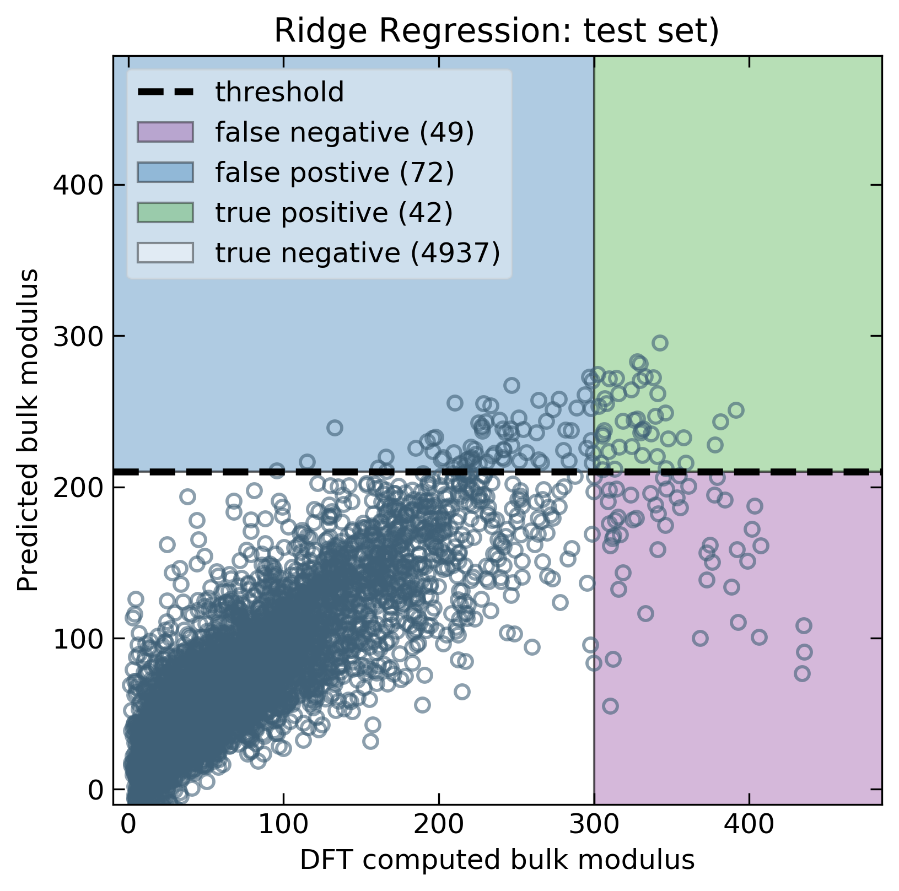
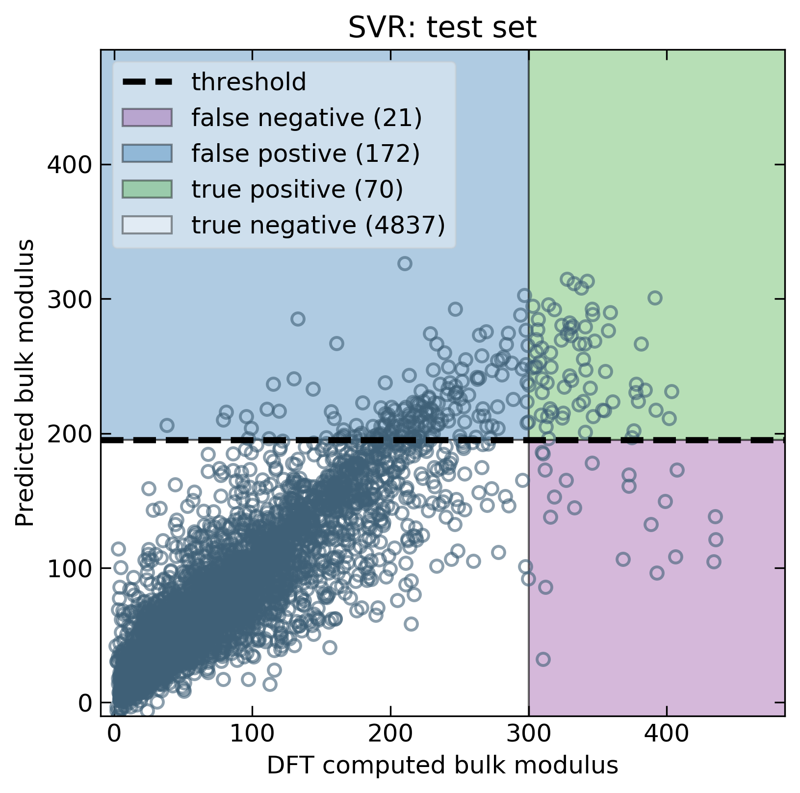

# MRS Open Data Challenge


# Beyond the Training Set: An Exercize in Extrapolation


# 1. Abstract


One of the most common criticisms of machine learning in materials science is an assumed inability for models to extrapolate beyond the training data set. This work uses a dataset containing close to 12,000 DFT computed bulk modulus values, taken from the materials project and AFLOW databases, to evaluate whether machine learning is truly capable of predicting materials with properties that extend beyond previously seen values. To do this, we first held out the top 100 compounds from the data.  After which, we performed a train test split and assigned the top 100 compounds (referred to as "extraordinary") to the test set. This procedure allowed us to generate useful metrics in regards to extrapolative model potential. In this work, we found that a straight forward regression can identify a limited number of extraordinary materials. However, we show that this approach is inferior to a simple logistic regression (classification tool) that was trained to identify the top 100 compounds of the training set as "extraordinary" and the rest as ordinary. This classification approach leads to better precision and recall values when compared to regression models. Overall, this work results in two key findings. First, model extrapolation is a reality for the bulk modulus system we explored. Second, a machine learning classifier is likely to be more effective than regression tools for the exploration of extraordinary materials. 


# 2. Objectives

Investigate the capabilities of machine learning for extrapolation. 

    a. Explore the capability of a typical regression approach
        - Are linear or non-linear models better?  
        - Can any algorithm lead to successful extrapolation?

    b. Compare to a classification approach

# 3. Methodology

## Curating the data

DFT computed bulk modulus (K, Voigt-Ruess-Hill) data were gathered from the materials project (MP) and the AFLOW online repository. For the materials project data, we applied a "lowest formation energy" selection criteria to remove duplicate formula. For the AFLOW data, we averaged duplicate values. These data sets were then combined. In the case of duplicates, AFLOW values were selected over MP since they are associated with an actual ICSD structure. The combined data resulted in approximately 12,000 unique formulae and their respective bulk modulus values. 

## Application of machine learning


### ```process_data.py```

The combined data was read in as a pandas DataFrame containing 12029 unique formula. After vectorization, the data was reduced down to 11993 compounds with 176 features (see ```composition.py```) after removing compounds with the elements Pa and Pu. We then converted the data into a training set and a testing set. The test set (size = 5100) is composed from the data with the highest 100 values (K = 297-435 GPa) and 5000 randomly selected compounds from the bottom 11895 compounds. The training set (size = 6893) contains the remaining data (max K = 296 GPa).

To allow for a classification task, we needed to label the data. For the test set, we converted these values into labels representing "extraordinary" (K > 300 GPa) and "ordinary" (K < 300 GPa). The training set was labeled with "extraordinary" values above K = 245 GPa leaving the rest as "ordinary".

Due to the limitations of gradient descent algorithms, we also normalized and standardized the feature vectors both for training and test data. This was done using ```sklearn.preprocessing.StandardScaler``` and ```sklearn.preprocessing.Normalizer```.

After processing, the data was saved to CSV files:

    X_train.csv
    X_test.csv
    X_train_scaled.csv
    X_test_scaled.csv
    y_train.csv
    y_test.csv
    y_train_label.csv
    y_test_label.csv

### ```composition.py```

The bulk modulus data only contains formulae and bulk modulus values. These formulae need to be converted to features. The featurization is done using functions from the custom file, ```composition.py```. These functions parse the formula and read in elemental properties. These properties are then made into features by using the sum, mean, range, and variance of elemental properties in the formula. The feature vectors and the bulk modulus values are returned for each formula. 
    
### ```MRS -- Open Data Challenge.ipynb```

This file outlines the programming steps required to obtain the final results and figures we discuss below. The file is split into two parts. The first section performs the optimization, training, and testing of linear (ridge) and non-linear (SVR) regressions models. Optimization steps are done using a grid search. Training metrics are obtained with 5-fold cross-validation. Test metrics are computed from a model created using the full training data.

The second section considers classification models. This is done using the same type of optimization, training, and testing but using different endpoints (log-loss vs. R2). These classification models also introduce the idea of decision making based on threshold values. These values can be optimized on the training set and used for obtaining performance metrics (precision and recall) on the test set. We can perform similar thresholding on the regression data and compare the classification and regression model performance side by side using the same metrics.

### ```utils.py```

This function contains code that is not critical to the submission but gives good visualization and simplified code cells.

# 4. Analysis and Results

Two key metrics were examined to determine the ability of machine learning algorithms to extrapolate, **precision** and **recall**. Precision and recall are formally defined by the following,


```math
precision = tp / (tp+fp) = # correct / (# predicted as extraordinary)
```

```math
recall = tp / (fn+tp) = # identified / (# of extraordinary compounds)
```

where tp, fp, tn, fn are the true-positives, false-positives, true-negatives, and false-negatives respectively. As mentioned above, formulae with bulk modulus values above 300 GPa were marked as extraordinary (positive) or ordinary (negative). This corresponds to predicting an extraordinary compound as extraordinary (tp), predicting an ordinary compound and extraordinary (fp), predicting ordinary compounds as ordinary (tn) and predicting extraordinary compounds as ordinary (fn).

We use precision as our metric for telling us how often we expect our predictions to be correct. If I predict 240 compounds as extraordinary, a precision of 0.5 indicates that we can expect 120 compounds to actually be extraordinary.

We use recall as our metric for understanding the fraction of extraordinary compounds we are actually identifying. If there exist 200 unknown extraordinary compounds, a recall of 0.25 indicates that we should expect to identify about 50 of those as extraordinary when using our trained model.

With these metrics in mind, we can compute precision and recall for all models. The results suggest that the classification-based approach outperforms the regression models (See Table below). We should note that these values will change as the threshold changes. For this report, we selected our desired thresholds on the training data before applying them to the test set. The decision to optimize recall vs precision will determine optimal threshold values. Nevertheless, for this report, we seek only to demonstrate the ability to extrapolate in general terms.

| Model type| Precision  | Recall |
|:---|:---|:---|
|Ridge Regression | 0.37 | 0.46 |
|Support Vector Regression | 0.29 | 0.77 |
|Logistic Regression | 0.48 | 0.78 |
|Support Vector Classifciation | 0.43 | 0.79 |

The following figures show the distinct advantages to a classification approach. For example, using a model with high precision will result in fewer tests before identifying extraordinary compounds. We can see that the logistic regression generally has a higher precision when compared to regression models. If extraordinary materials exist, models with a higher recall will be better at finding them. The classification-based models exhibit a higher recall while maintaining an acceptable precision. Therefore, classification-based models are more useful for correctly identifying extraordinary compounds. 

| | Linear  | Non-linear|
|:---|:---|:---|
|**Regression** | |   |  
|**Classification** |   |  |

Ultimately, the objective is to evaluate whether or not extrapolation is possible in materials research. All four models clearly extrapolate beyond the training data. This evidence of extrapolation has an important implication for materials discovery. Namely, that we can expect a machine learning approach, at least in the case of bulk modulus, to assist in tasks that invovle identifying outstanding materials. With that said, these results rely on some key assumptions to hold true:

1. DFT is a reliable tool for bulk modulus calculations, even at extreme values. 

2. The distribution of bulk modulus values from these DFT calculations accurately reflects the distribution of real compounds.

3. The ratio of ordinary to extraordinary compounds matches the assumed ratio from this analysis. In other words, there must be 200 undiscovered compounds with bulk moduli near 400 Gpa for us to expect similar results with the available data (in the case of classification-based models).

# 4. Conclusions

While the predictive power of machine learning is well known, these models are generally designed to predict within the range of the model's training data. This leaves many researchers questioning whether these models can be used to extrapolate within the realm of materials research. We used various machine learning algorithms to explore the extrapolative power of models trained using a common material property, bulk modulus. Specifically, we looked at a linear regression (ridge regression) a non-linear regression (support vector regression), a linear classifier (logistic regression), and a non-linear classifier (support vector classification). While all algorithms showed predictive power, the classification models outperformed the regression models to a considerable extent. However, there was little difference between linear and non-linear models. 

Overall, we show there is promise in using machine learning models for facilitating the discovery of record breaking materials. However, we caution that these models are unlikely to break into new chemistries with unexpected mechanisms. That said, the favorite model (logistic regression) achieves a precision of 0.48 and a recall of 0.78. This corresponds to a model with the ability to identify 80% of extraordinary materials while still getting half the recommendations correct. From a scientific perspective, this corresponds to outstanding materials on every other attempt. A feat that is nothing less than... Extraordinary. 
